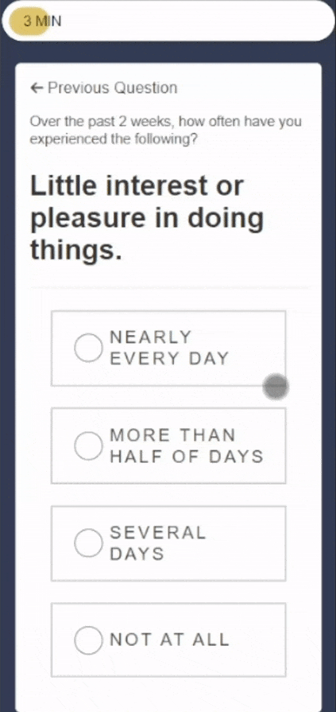

# Fin vs Fin Mental Health Questionnaire

This quiz was developed by me, with design guidance from my supervisor. This quiz is meant to get the user to think about their mental health status before guiding them to lists of affiliate links to vetted companies.

<i>Disclaimer: This quiz does not provide a professional diagnosis and is not intended as a substitute, but rather only a precursor, to consulting a licensed physician</i>

## Tech Stack

**Client:** HTML, CSS, Javascript (ES6)

**Backend:** None

The quiz was planned to be static, without the URL changing since my supervisor plans to upload this to Wordpress. Therefore the HTML page is very large, but only parts of it are rendered at a time. The Javascript keeps track of the page the user should be on and figures out which "page" to render from there"

## Deployment

This project is currently deployed to https://rssebastian.github.io/mh_landing/ and https://finvsfin.com/5-min-anxiety-test/

## Demo

  
  
  
If you reach the page below, the quiz the meant to stop and inform the user that if they are already planning self-harm, they should look into the resources listed instead of continuing the quiz. However, the user may click the back arrow to return to previous question, and if they choose "A Vague Thought" instead, the quiz will continue.

